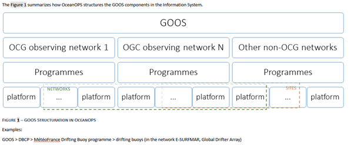

[cols=",",options="header",]
|===========================================================================================
|image:figures/image1.png[image,width=164,height=144] a|
OceanGliders 1.0 format - Terms of References

|===========================================================================================

////
* [[Methodology]]
////
== Methodology

A working group on harmonization of the glider data format was set up in September 2020 at the request of the OceanGliders steering team. All members of the OceanGliders data management team were invited to join.
The three existing formats (at the time) were analysed and compared by the group. Regular technical meetings occurred and the format harmonization process was managed via a google doc. In late 2021 the group decided to move the document to https://github.com/OceanGlidersCommunity/OG-format-user-manual[GitHub] to better manage the issues, work asynchronously and contribute to the open source community.
The GitHub repository was open to any comments from the community and validation rules were created by the working group.
From there the working group organized regular meetings to validate the evolution of the format, discuss issues and finally reach a consensus on the OG1.0 format.

////
* [[Authors]]
////
== Authors

=== Original authors
* https://github.com/justinbuck[Justin Buck], _National Oceanography Centre, British Oceanographic Data Centre, UK_ https://orcid.org/0000-0002-3587-4889[0000-0002-3587-4889]
* https://github.com/castelao[Guilherme Castelão], _Scripps Institution of Oceanography - UC San Diego, USA_ https://orcid.org/0000-0002-6765-0708[0000-0002-6765-0708]
* https://github.com/emmerbodc[Emma Gardner], _National Oceanography Centre, British Oceanographic Data Centre, UK_ https://orcid.org/0009-0007-9640-7268[0009-0007-9640-7268]
* https://github.com/glidermann[Daniel Hayes], [OGDMTT co-chair], _Cyprus Subsea Consulting and Services C.S.C.S. Ltd, Cyprus_ https://orcid.org/0000-0003-0141-9973[0000-0003-0141-9973]
* https://github.com/kerfoot[John Kerfoot], _Institute of Marine & Coastal Sciences, Rutgers University, New Jersey, USA_ https://orcid.org/0000-0003-1405-4248[0000-0003-1405-4248]
* https://github.com/vturpin[Victor Turpin], [OGDMTT co-chair],  _OceanGliders Technical Coordinator at OceanOPS, Brest, France_ https://orcid.org/0000-0002-1662-4358[0000-0002-1662-4358]

=== Contributors
* https://github.com/soerenthomsen[Sören Thomsen], _LOCEAN, ISPL, Sorbonne University, Paris, France,_ https://orcid.org/0000-0002-0598-8340[0000-0002-0598-8340]
* https://github.com/ptestor[Pierre Testor], _National Centre for Scientific Research, France_ https://orcid.org/0000-0002-8038-9479[0000-0002-8038-9479]
* https://github.com/JuangaSocib[Juan Gabriel Fernández Pineda], _SOCIB, Mallorca, Spain_ https://orcid.org/0000-0002-8732-7887[0000-0002-8732-7887]
* https://github.com/tcarval[Thierry Carval], _IFREMER, Brest, France_ https://orcid.org/0000-0003-2700-4020[0000-0003-2700-4020]
* https://github.com/callumrollo[Callum Rollo], _Voice of the Ocean Foundation, Sweden_ https://orcid.org/0000-0002-5134-7886[0000-0002-5134-7886]
* https://github.com/jenseva[Jennifer Sevadjian], _Scripps Institution of Oceanography - UC San Diego, USA_ https://orcid.org/0000-0001-9286-2043[0000-0001-9286-2043]

=== Acknowledgements

Several organisations were instrumental in the development of this format. OceanGliders, UG2, and EGO provided encouragement and forums for initial discussion. Some authors received support from, amongst others, EuroSEA, AtlantOS, GOMO, EMODnet Physics, and GROOM II.

////
* [[background]]
////
== Background

The OceanGliders program brings together marine scientists and glider operators from all over the world who observe the long-term physical, biogeochemical, biological ocean processes, and phenomena relevant for societal applications. It allows active coordination and strengthening the roles of gliders in the ocean observation programs worldwide and contributes to the present international efforts for ocean observation for climate, ocean health and real-time services.

The program oversees the monitoring of global glider activity, a prerequisite for active coordination. By sharing requirements, efforts and scientific knowledge needed for glider data collection OceanGliders aims to continuously develop the network by supporting the dissemination of glider data in global databases, in real-time and delayed mode, for a wider community.

The OceanGliders program was created about 10 years after the popularization of the use of gliders by ocean scientists. With no common rules on format, data managers from Australia, the USA, and Europe processed 3 regional formats that are not interoperable.

Harmonization toward interoperability within the existing formats and many national/regional glider networks is a recommendation from the OceanGliders steering team to strengthen the program and reach the FAIR principles (Findable, Accessible, Interoperable, Reusable) adopted by GOOS (Global Ocean Observing System), and better monitor the program activity.

////
* [[objectives]]
= Objectives
////
== Objectives

This document defines the common OceanGliders data format, hereafter OG1.0.

////
* [[og1.0-general-conventions]]
= OG1.0 General conventions
////
== OG1.0 General conventions

* The required granularity of the data set is the glider mission, starting from deployment at sea to recovery.

* Data are recorded as a trajectory Discrete Geometry, using NetCDFfootnote:[NetCDF-3 does not satisfy the requirements of OG1.0 format] system and following CF 1.8footnote:[http://cfconventions.org/Data/cf-conventions/cf-conventions-1.8/cf-conventions.html#trajectory-data] (Climate and Forecast) specifications. Each data file contains a series of dive cycles representing the mission of the glider. It can be produced in near real time after every glider transmission and revised later into a recovery-mode (when glider on shore and any data gaps filled in) or a delayed-mode (after rigorous QC) version.
* Format follows the ACDD 1.3 convention.
* Variables are identified in capital letters.
* Attributes are identified in lower case.
* Vocabulary collections will be hosted in different places (NERC Vocabulary Server - NVS, OceanOPS, ICES, etc). The OceanGliders data management team will manage (additions, updates, etc.) the collections.
* OG1.0 oversees the following parameters: CTD measurements, Oxygen measurements, Optical fluorescence, and backscatter measurements. Other types of measurements (intermediate parameters, technical measurements, and other variables) not framed by OG1.0 could be included in OG1.0 data files. No control will be applied to those measurements.
* GPS variables and along-track positioning variables are mandatory.
* Interpolation methodologies used to compute along-track positioning variables, phases and QC needs publishing as a best practice document under strict rules.
* A list of mandatory metadata describing the data set is defined below.
* It is highly encouraged to use a unique resource identifier (uri) to increase machine-to-machine communications.
* 3 recommendations level have been defined for attributes:

  - Mandatory: Minimum metadata set to be compliant with OG1.0 requirement.
	- Highly desirable: Worth having for complete use of the data set.
	- Suggested: If the information is available.

== DOI management

* DOI can be minted at any level (PI, Reference Data Center, Data Assembly Center, Global Data Assembly Center) following the internal policy of data curation.
* DOI can be minted for a single glider mission or multiple glider missions (i.e. project, reference lines).
* DOI if included in OG1.0 files needs to be preserved. The DOI must remain unchanged if there is no valuable modification. If valuable information is aggregated/added or a new product produced, a new DOI shall be created and the new DOI MUST link to the original DOI to acknowledge as the source
* GDACs will create an evolving global data set with a DOI referring to all existing DOIs.
* The most effective way of preserving the integrity of the source citation is to preserve the intitial DOI added in the OG1.0 file.

////
* [[og1.0-file-naming-convention]]
= OG1.0 file naming convention
////
== OG1.0 file naming convention

* Data files should be named as follows:

	- "file_name" : "<id>.nc" (ex : "sp065_20210616T1430_R.nc")

* Recalling that:
	- "id" : "<trajectory>_<data_mode>" (ex : "sp065_20210616T1430_R")
	- "trajectory" : "<platform_name>_<start_date>" (ex :  "sp065_20210616T1430")
	- "platform_name", "start_date", "data_mode" are as described below in this document.

////
* [[global-attributes]]
= Global attributes
////
== Global attributes

The global attribute section is used for data discovery. The following global attributes should appear in the global section. The NetCDF Climate and Forecast (CF) Metadata Conventions are available from: http://cfconventions.org/Data/cf-conventions/cf-conventions-1.10/cf-conventions.html#trajectory-data[_http://cfconventions.org/Data/cf-conventions/cf-conventions-1.10/cf-conventions.html#trajectory-data_]. It is recommended that extra global attributes follow ACDD convention".

[cols="5,6,3,6a",options="header",]
|=====================================================================================================================================================================================================================================================================================
|*Global attribute* |*Definition* |*Requirement status* |*Format, fixed value or example*
|title |A short phrase or sentence describing the dataset. |mandatory |ex.: “OceanGliders trajectory file”
|platform a|
Name of the platform(s) that supported the sensors data used to create this data set or product.

https://vocab.nerc.ac.uk/collection/L06/current/[_https://vocab.nerc.ac.uk/collection/L06/current/_]

 |mandatory |"sub-surface gliders"
|platform_vocabulary |Controlled vocabulary for the names used in the "platform" attribute. |mandatory |https://vocab.nerc.ac.uk/collection/L06/current/27/[_https://vocab.nerc.ac.uk/collection/L06/current/27/_]
|id a|
Formatted mission name: <platform_name>_<start_date>_<data_mode>

|mandatory |
ex.:

* sverdrup_20200512T001245_delayed
* SL287_20180715T012451_delayed
* p202_20150923T150451_R

|naming_authority a|
A unique name that identifies the institution who provided the id.
ACDD-1.3 recommends using reverse-DNS naming.
|highly desirable |
ex.:

* IOOS
* IMOS
* Coriolis
* edu.ucsd.spray

|institution a|
The name of the institution where the original data was produced.

|highly desirable |
ex.:

* Texas A-M University
* IMOS
* PLOCAN

|internal_mission_identifier a|
The mission identifier used by the institution principally responsible for originating this data

 |highly desirable |

ex.:

* sverdrup_20200512_delayed
* Forster20201109
* Estoc_2015

|geospatial_lat_min |Describes a simple lower latitude limit |suggested |decimal degree
|geospatial_lat_max |Describes a simple upper latitude limit |suggested |decimal degree
|geospatial_lon_min |Describes a simple longitude limit |suggested |decimal degree
|geospatial_lon_max |Describes a simple longitude limit |suggested |decimal degree
|geospatial_vertical_min |Describes the numerically smaller vertical limit. |suggested |meter depth
|geospatial_ vertical_max |Describes the numerically larger vertical limit |suggested |meter depth
|time_coverage_start | | |iso 8601
|time_coverage_end | | |iso 8601
|site |The name of the regular sample line or area. |highly desirable |
|site_vocabulary |Controlled vocabulary of the names used in the “site” attribute |highly desirable |To be defined
|program |The overarching program(s) of which the dataset is a part. A program consists of a set (or portfolio) of related and possibly interdependent projects that meet an overarching objective. |Highly desirable |
|project |The name of the project(s) principally responsible for originating this data. Multiple projects can be separated by commas |suggested |
|network |A network is a group of platforms crossing the boundaries of a single program. It can represent a mutual scientific objective, a geographical focus, an array and/or a project. Multiple networks shall be separated by commas. |suggested |
|contributor_name |Name of the contributors to the glider mission. Multiple contributors are separated by commas. |PI name is mandatory |
|contributor_email |Email of the contributors to the glider mission. Multiple contributors' emails are separated by commas. |PI email is mandatory |
|contributor_id |Unique id of the contributors to the glider mission. Multiple contributors’ ids are separated by commas. |highly desirable |
|contributor_role |Role of the contributors to the glider mission. Multiple contributors’ roles are separated by commas. |PI vocabulary is mandatory |
|contributor_role_vocabulary |Controlled vocabulary for the roles used in the "contributors_role". Multiple contributors’ roles and vocabularies are separated by commas. |PI vocabulary is mandatory |http://vocab.nerc.ac.uk/search_nvs/W08/[_http://vocab.nerc.ac.uk/search_nvs/W08/_]
|institution |Name of institutions involved in the glider mission. Multiple institutions are separated by commas. |operating institution is mandatory |
|institution_role |Role of the institutions involved in the glider mission. Multiple institutions' roles are separated by a comma. |operating institution role is mandatory |
|institution_role_vocabulary |The controlled vocabulary of the role used in the institution's role. Multiple vocabularies are separated by commas. |operating institution vocabulary is mandatory |https://vocab.nerc.ac.uk/collection/C86/current/[_https://vocab.nerc.ac.uk/collection/C86/current/_]
|institution_id |code of the institution involved in the glider mission. Multiple ids are separated by a comma. |highly desirable |
|institution_id_vocabulary |url to the repository of the id |highly desirable |EDMO, ROR, etc.
|uri |Other universal resource identifiers relevant to be linked to this dataset. Multiple uris are separated by a comma. |suggested |EDIOS, CSR, EDMERP, EDMED, CDI, ICES, etc.
|data_url |url link to OG1.0 data file |mandatory |
|doi |The digital object identifier of the OG1.0 data file |highly desirable |
|rtqc_method |The method used by DAC to apply real-time quality control to the data set |mandatory |
|rtqc_method_doi |The digital object identifier of the methodology used to apply real-time quality control to the data set. |mandatory |
|web_link |url that provides useful information about anything related to the glider mission. Multiple urls are separated by commas. |suggested |
|comment |Miscellaneous information about the data or methods used to produce it. |suggested |
|date_created |date of creation of this data set |mandatory |iso 8601
|featureType |Description of a single feature with this discrete sampling geometry |mandatory |trajectory
|Conventions |A comma-separated list of the conventions that are followed by the dataset. |mandatory |ex.: "CF-1.9, ACDD-1.3, OG-1.0"
|=====================================================================================================================================================================================================================================================================================

Note about program, networks, and sites:
Some examples are provided in <<ProgramNetworkSite-example>>.
The image below describes the architecture of the GOOS/OceanOPS database.

////
* [[dimension-and-definition]]
= Dimension and definition
////
== Dimension and definition

[cols=",,",options="header",]
|=================================================================================================================================================================================================================================================================
|*Name* |*Definition* |*Comment*
|N_MEASUREMENTS |N_MEASUREMENTS = unlimited; |Number of recorded locations.
| N_SENSOR| N_SENSOR = <int value>; | Number of sensors mounted on the float and used to measure the parameters. 
Example for a float with CTD, ECO_FLBBCD and OPTODE: CTD_TEMP, CTD_PRES, CTD_CNDC, OPTODE_DOXY, FLUOROMETER_CHLA, FLUOROMETER_CDOM, BACKSCATTERINGMETER_BBP700 ; N_SENSOR = 7
|N_PARAM |N_PARAM = <int value>; |Number of parameters measured or calculated for a pressure sample. Examples for a float with CTD, ECO_FLBBCD and OPTODE : PRES, TEMP, CNDC, PSAL,  MOLAR_DOXY, TEMP_DOXY, CHLA, CDOM, BETA700) : N_PARAM = 9
|=================================================================================================================================================================================================================================================================

////
* [[location-variables]]
= Location variables
////
== Location variables
////
** [[gps-variables]]
== GPS variables
////
=== GPS variables

OG1.0 requirements cover the GPS variables delivered by the glider when at the sea surface.

* OG1.0 requirement for GPS variables: The table below describes mandatory GPS variables and their attributes.

[cols="1a,2a,1",options="header",]
|============================================================
|*VARIABLE NAME* |*variable attributes* |*requirement status*
|LATITUDE_GPS

* data type: double
* dimension: N_MEASUREMENTS |

* long_name = “latitude of each GPS location”;
* standard_name = “latitude”;
* units = “degrees_north”;
* _FillValue = -9999.9;
* valid_min = -90.0;
* valid_max = 90.0;
* ancillary_variables = "LATITUDE_GPS_QC"

 |mandatory
|LONGITUDE_GPS

* data type: double
* dimension: N_MEASUREMENTS |

* long_name = “longitude of each GPS location”;
* standard_name = “longitude”;
* units = “degrees_east”;
* _FillValue = -9999.9;
* valid_min = -180.0;
* valid_max = 180.0;
* ancillary_variables = "LONGITUDE_GPS_QC"

 |mandatory
|TIME_GPS

* data type: double
* dimension: N_MEASUREMENTS |

* long_name = “time of each GPS location”;
* calendar = "gregorian" ;
* units = “seconds since 1970-01-01T00:00:00Z”;
* _FillValue = -1.0 ;
* valid_min = 1e9 ;
* valid_max = 4e9 ;
* ancillary_variables = “TIME_GPS_QC”

 |mandatory
|============================================================

Note: TIME_GPS is a legacy channel kept to ensure interoperbility with EGO formats theat preceded OceanGliders format.

////
* [[along-track-positioning-variables]]
== Along track positioning variables
////
== Along track positioning variables

OG1.0 requirements cover positioning variables and geolocating any scientific measurements made by the glider during its mission.

* OG1.0 requirement for positioning variable: The table below describes the mandatory positioning variables and their attributes.

[cols="1a,2a,1",options="header",]
|============================================================
|*VARIABLE NAME* |*variable attributes* |*requirement status*
|LATITUDE

* data type: double
* dimension: N_MEASUREMENTS |

* long_name = “latitude of each measurements and GPS location”;
* standard_name = “latitude”;
* units = “degrees_north”;
* _FillValue = -9999.9;
* valid_min = -90.0;
* valid_max = 90.0;
* ancillary_variables = "LATITUDE_GPS_QC"
* interpolation_methodology = “”;
* interpolation_methodology_vocabulary = “”;
* interpolation_methodology_doi = “”;

 |mandatory
|LONGITUDE

* data type: double
* dimension: N_MEASUREMENTS |

* long_name = “longitude of each measurements and GPS location”;
* standard_name = “longitude”;
* units = “degrees_east”;
* _FillValue = -9999.9;
* valid_min = -180.0;
* valid_max = 180.0;
* ancillary_variables = "LONGITUDE_GPS_QC";
* interpolation_methodology = “”;
* interpolation_methodology_vocabulary = “”;
* interpolation_methodology_doi = “”;

 |mandatory
|TIME

* data type: double
* dimension: N_MEASUREMENTS |

* long_name = “time of measurement”;
* calendar = "gregorian" ;
* units = “seconds since 1970-01-01T00:00:00Z”;
* _FillValue = -1.0 ;
* valid_min = 1e9 ;
* valid_max = 4e9 ;
* ancillary_variables = “TIME_GPS_QC”;
* interpolation_methodology = “”;
* interpolation_methodology_vocabulary = “”;
* interpolation_methodology_doi = “”;

 |mandatory
|============================================================

Interpolation methodologies need publishing as a best practice document separately to the OG1.0 terms of reference.

See parameters section for guidance on attributes and convetions on _QC channels.

////
* [[general-information]]
= General information
////
== General Information

In this following section, two options, “encapsulate variable” and “individual variable” are proposed to store the general information.

////
* [[trajectory-name]]
== Trajectory name
////
== Trajectory Name

[cols=",,",options="header",]
|===========================================================================================================================
|*VARIABLE NAME* |*variable attributes* |*requirement status*
|TRAJECTORY a|
string TRAJECTORY

TRAJECTORY:cf_role = "trajectory_id"

TRAJECTORY:long_name = “trajectory name”;

TRAJECTORY:data_mode_vocabulary = “”;

 a|
mandatory

Value: <platform_name>_<start_date>

Where <platform_name> refers to the name of the glider, <start_date> refers to the deployment start UTC date under iso 8601,

Ex : eltanin_20210909T1605

If the glider has no <platform_name> use <platform_serial_number> instead to create the TRAJECTORY

Ex.: sp042_20210218T2325

|===========================================================================================================================

////
* [[platform-information]]
== Platform information
////
=== Platform information

[cols=",,",options="header",]
|========================================================================================
|*VARIABLE NAME* |*variable attributes* |*requirement status*
|PLATFORM_MODEL a|
string PLATFORM_MODEL

PLATFORM_MODEL:long_name: “model of the glider”;

PLATFORM_MODEL:platform_model_vocabulary = “”;

 |mandatory
|WMO_IDENTIFIER a|
string WMO_IDENTIFIER

WMO_IDENTIFIER:long_name = “wmo id”;

 |mandatory
|PLATFORM_SERIAL_NUMBER a|
string PLATFORM_SERIAL_NUMBER

PLATFORM_SERIAL_NUMBER:long_name = “glider serial number”;

 |highly desirable
|PLATFORM_NAME a|
string PLATFORM_NAME

PLATFORM_NAME:long_name = “Local or nickname of the glider”;

 |highly desirable
|PLATFORM_DEPTH_RATING a|
integer PLATFORM_DEPTH_RATING

PLATFORM_DEPTH_RATING:long_name = “depth limit in meters of the glider for this mission”;

PLATFORM_DEPTH_RATING:convention = “positive value expected - e.g. 100m depth = 100”;

 |highly desirable
|ICES_CODE a|
string ICES_CODE

ICES_CODE:long_name = “ICES platform code of the glider” ;

ICES_CODE :ices_code_vocabulary = “” ;

 |highly desirable
|PLATFORM_MAKER a|
string PLATFORM_MAKER

PLATFORM_MAKER:long_name = “glider manufacturer”;

PLATFORM_MAKER:platform_maker_vocabulary = “”;

 |suggested
|========================================================================================

////
* [[deployment-information]]
== Deployment information
////
=== Deployment information

[cols=",,",options="header",]
|============================================================
|*VARIABLE NAME* |*variable attributes* |*requirement status*
|DEPLOYMENT_TIME a|
double DEPLOYMENT_TIME

DEPLOYMENT_TIME:long_name = “date of deployment”;

DEPLOYMENT_TIME:standard_name = "time";

DEPLOYMENT_TIME:calendar = "gregorian";

DEPLOYMENT_TIME:units = "seconds since 1970-01-01T00:00:00Z";

 |mandatory
|DEPLOYMENT_LATITUDE a|
double DEPLOYMENT_LATITUDE

DEPLOYMENT_LATITUDE:long_name = “latitude of deployment”;

 |mandatory
|DEPLOYMENT_LONGITUDE a|
double DEPLOYMENT_LONGITUDE

long_name = “longitude of deployment”;

 |mandatory
|============================================================

* [[section]]
==

////
* [[field-comparison-information]]
== Field comparison information
////
=== Field comparison information

[cols=",,",options="header",]
|=========================================================================================================================================
|*VARIABLE NAME* |*variable attributes* |*requirement status*
|FIELD_COMPARISON_REFERENCE a|
String FIELD_COMPARISON_REFERENCE:

FIELD_COMPARISON_REFERENCE:long_name = “links (uri or url) to supplementary data that can provide field comparison for platform sensors.”;

FIELD_COMPARISON_REFERENCE:comment = “multiple links are separated by a comma”

 |highly desirable
|=========================================================================================================================================

Note: FIELD_COMPARISON_REFERENCE is applicable to deployment, recovery, and delayed versions.

////
* [[hardware-information]]
== Hardware information
////
=== Hardware information

[cols=",,",options="header",]
|=============================================================================
|*VARIABLE NAME* |*variable attributes* |*requirement status*
|GLIDER_FIRMWARE_VERSION a|
string GLIDER_FIRMWARE_VERSION

GLIDER_FIRMWARE_VERSION:long_name = “version of the internal glider firmware”;

 |highly desirable
|LANDSTATION_VERSION a|
string LANDSTATION_VERSION

LANDSTATION_VERSION:long_name = “version of the server onshore”;

 |highly desirable
|BATTERY_TYPE a|
string BATTERY_TYPE

BATTERY_TYPE:long_name = “type of the battery”;

BATTERY_TYPE:battery_type_vocabulary = “”;

 |suggested
|BATTERY_PACK a|
string BATTERY_PACK

BATTERY_PACK:long_name = “battery packaging”;

 |suggested
|=============================================================================

////
* [[telecom-information]]
== Telecom information
////
=== Telecom information

[cols=",,",options="header",]
|===============================================================================
|*VARIABLE NAME* |*variable attributes* |*requirement status*
|TELECOM_TYPE a|
string TELECOM_TYPE

TELECOM_TYPE:long_name = “type of telecommunication systems used by the glider”;

TELECOM_TYPE:telecom_type_vocabulary = “”;

 |highly desirable
|TRACKING_SYSTEM a|
string TRACKING_SYSTEM

TRACKING_SYSTEM:long_name = “type of tracking systems used by the glider”;

TRACKING_SYSTEM:tracking_system_vocabulary = “”;

 |highly desirable
|===============================================================================

////
* [[phase-variable]]
= Phase variable
////
== Phase variable

PHASE describes the glider behaviors when at sea. The different behaviors are described in the phase vocabulary (ascent, descent, surfacing, parking, inflection, etc.)

Note that the vocabulary will be fully described and implemented in the control vocabulary tool during the implementation phase.

Phase calculation methodologies need publishing as a best practice document separately to the OG1.0 terms of reference.

The tables below describe the mandatory information to PHASE stored in two ways.

[cols=",,",options="header",]
|=============================================================
|*VARIABLES NAME* |*variable attributes* |*requirement status*
|PHASE a|
Byte PHASE(N_MEASUREMENTS)

PHASE:long_name = “behavior of the glider at sea”;

PHASE:phase_vocabulary: “url to phase vocab list”;

PHASE:_FillValue = 0b ;

PHASE:phase_calculation_method = “”;

PHASE:phase_calculation_method_vocabulary = “”;

PHASE:phase_calculation_method_doi = “”;

PHASE: ancillary_variables = "PHASE_QC"

 |Highly desirable
|PHASE_QC a|
Byte PHASE_QC(N_MEASUREMENTS)

PHASE_QC:long_name = "quality flag";

PHASE_QC:_FillValue = " ";

PHASE_QC:valid_range = 0b, 1b, 2b, 3b, 4b;

PHASE_QC:flag_values = 0b, 1b, 2b, 3b, 4b;

PHASE_QC:flag_meanings = "No QC has been applied
			Good data
			Probably good data
			Probably bad data
			Bad data" ;

 |Highly desirable
|=============================================================

Note 1: For a simple case, PHASE calculation is relatively easy. But in some cases, PHASE calculation remains difficult. When code will be available publicly and described in some published best practices, PHASE will become mandatory. Note 2: Quality control of the PHASE could be useful to manage difficult cases.

Note 2: PHASE is used to derive data product (profile, trajectory profiles, gridded product) from OG1.0 data sets. It is recommended to include PHASE when possible.

////
* [[sensor-information]]
= Sensor information
////
== Sensor information

This section contains information about the sensors of the glider. Each ocean state variable to be recorded must be described with its sensor. Gears with multiple sensors (i.e. CTD) should consider separated sensors in particular if there is not a unique serial number and calibration date for the sensors.

A sensor is a device used to measure a physical parameter. Sensor outputs are provided in parameter counts and need to be converted into parameter physical units using a calibration equation. This conversion can be done onboard the float or during the decoding process.

[cols=",,",options="header",]
|=============================================================
|*VARIABLE NAME* |*variable attributes* |*requirement status*
|SENSOR a|

string SENSOR(N_SENSOR)

SENSOR:long_name: “type of sensor”;

SENSOR:sensor_vocabulary = “”; | highly desirable 

|SENSOR_MODEL a|

string SENSOR_MODEL(N_SENSOR)

SENSOR_MODEL:long_name: “model of sensor”;

SENSOR_MODEL:sensor_model_vocabulary = “”; | highly desirable 

|SENSOR_MAKER a|

string SENSOR_MAKER(N_SENSOR)

SENSOR_MAKER:long_name: “manufacturer of the sensor”;

| highly desirable 

|SENSOR_SERIAL_NUMBER a|

string SENSOR_SERIAL_NUMBER(N_SENSOR)

SENSOR_SERIAL_NUMBER:long_name: “serial number of the sensor”; | highly desirable 

|SENSOR_CALIBRATION_DATE a|

string SENSOR_CALIBRATION_DATE(N_SENSOR)

SENSOR_CALIBRATION_DATE:long_name: “date of calibration of the sensor”;

SENSOR_CALIBRATION_DATE:format: “iso8601”;

SENSOR_CALIBRATION_DATE:comment: “YYYY-MM-DD”; 

SENSOR_CALIBRATION_DATE:calibration_link | highly desirable 

| SENSOR_UUID a|  

string SENSOR_UUID(N_SENSOR)

SENSOR_UUID:long_name: "Universal Unique Identifier", 

SENSOR_UUID:exemplar: "TOOL0669_75" <concept>_<serial_number>" | suggested  
|=============================================================

Note 1: SENSOR information is highly desirable to avoid ERDDAP configuration difficulties. When those difficulties will be overcome, some of the SENSOR information will become mandatory.
////
* [[parameters-information]]
= Parameter’s information
////
== Parameter’s information

A parameter is a measurement of a physical phenomenon; it can be provided by a sensor (in sensor counts or in physical units) or computed (derived) from other parameters. A sensor can measure 1 to N parameter(s). A parameter can be measured by 1 or N sensor(s).

This section contains information about the parameters measured by the glider or derived from glider measurements. The section is based on the approach used in
Argo formats and enables parameter information interoperability with major stakeholders such as CMEMS.

[cols=",,",options="header",]
|=======================================================================================================================================
|*VARIABLE NAME* |*variable attributes* |*requirement status*
|PARAMETER a|
string PARAMETER(N_PARAM)

PARAMETER:long_name = “name of parameter computed from glider measurements”;

PARAMETER:parameter_vocabulary = “_https://vocab.nerc.ac.uk/collection/OG1/current/_”;

 |highly desirable
|PARAMETER_SENSOR a|
string PARAMETER_SENSOR(N_PARAM)

PARAMETER_SENSOR:long_name = “”;

 |highly desirable
|PARAMETER_UNITS a|
string PARAMETER_UNITS(N_PARAM) PARAMETER_UNITS:long_name = “”;

PARAMETER_UNITS:parameter_units_vocabulary = “”;

 |highly desirable
|=======================================================================================================================================

Note 1: PARAMETER information is highly desirable to avoid ERDDAP configuration difficulties. When those difficulties will be overcome, some of the PARAMETER information will become mandatory.

////
* [[geophysical-variables]]
= Geophysical variables
////
= Geophysical variables
"The fill value should have the same data type as the variable and be outside of the range of possible data values."
[cols=",,",options="header",]
|==========================================================================================================================
|*VARIABLE NAME* |*variable attributes* |*requirement status*
|<PARAM> a|
float <PARAM>(N_MEASUREMENT);

<PARAM>:long_name = "<X>"; <PARAM>:standard_name = “<X>";

<PARAM>:vocabulary = “_https://vocab.nerc.ac.uk/collection/OG1/current/_";

<PARAM>:_FillValue = <X>;

<PARAM>:units = "<X>";

<PARAM>:ancillary_variables = "PARAM_QC";

<PARAM>:coordinates = "LATITUDE, LONGITUDE, DEPTH, TIME"

 a|
mandatory

<PARAM> contains the values of a parameter listed in the control vocabulary related to OceanGliders parameters.

<X>: these fields are specified in the control vocabularies.

|<PARAM>_QC a|
Byte <PARAM>_QC(N_MEASUREMENT); <PARAM>_QC:long_name = "quality flag";

<PARAM>_QC:_FillValue = " ";

<PARAM>_QC:valid_range = 0b, 1b, 2b, 3b, 4b;

<PARAM>_QC:flag_values = 0b, 1b, 2b, 3b, 4b;

<PARAM>_QC:flag_meanings = "No QC has been applied
			Good data
			Probably good data
			Probably bad data
			Bad data" ;

<PARAM>_QC:RTQC_methodology = “”;

<PARAM>_QC:RTQC_methodology_vocabulary = “”;

<PARAM>_QC:RTQC_methodology_doi = “”;

 |higly desirable
|==========================================================================================================================

Note: It is anticipated to upgrade the ancillary variable related to QC by refining the ancillary variable name like < PARAM >_qc_generic, < PARAM >_qc_spike_test, <PARAM>_qc_land_test, etc. Current _QC attributes based on CF guidance (https://cfconventions.org/Data/cf-conventions/cf-conventions-1.8/cf-conventions.html#flags)
and use the GOOS networks 0-4 flagging convention.

////
* [[Vocabulary Collections]]
////
== Vocabulary Collections

Series of concept of the https://github.com/OceanGlidersCommunity/OG1.0-user-manual[OG1.0 format] are controlled by a collection of vocabularies managed by the OceanGliders data management team and other governance boddy. +
These concepts are listed in the table below. Each concept is linked to its collection of vocabularies. Each element of the collection has a status attribute. +
[square]
* The *validated* entries have been validated by the vocabulary working group and can be used in the OG1.0 format. +
* The *published* entries have been published by the host when it exist. +
* The *pending* entries are being discussed by the community and are not yet supported by the OG1.0 format. +

Vocabularies that are not governed by OceanGliders do not follow the *status* convention described above.

=== "host" and "governance" of vocabulary collection

**host** : The host is the entity that is serving the *published* vocabularies. A collection served by host enable the machine to machine communication. +
**governance** :  Governance refers to the entity in charge of the maintenance, evolution and publication of the vocabulary collection.

=== Request a new entry

To request a new entry in any of the collection listed below, you should submit an issue to this repository entitle `*_new entry for table <name of the vocabulary>_*` . 
The issue must indicate the value of the new entry and all its relevant attributes described in the corresponding table.
                                                                                        
=== Validation process
  
A working group on controlled vocabulary will review the requests for new vocabularies regularly.
While a continuous update of the controlled vocabularies is anticipated, the working group will update a new version of controlled vocabulary at least twice a year.
The aim is to update the collection on the host server at least once a year.

=== Non synchronised list
It is expected that the vocabulary collections will not always been synchronized between this repository and the host services. There will be a lag between validating a entry here and this entry being published in the host. This lag is due to different governance and validation rules between governance and host. +

`*The reference lists are the lists available below.*`

=== Table of controlled vocabularies
  
|===
|Metadata fields | link to reference collection | Link to host | Governance | 

  | platform | https://vocab.nerc.ac.uk/collection/L06/current/25/[collection] |  https://vocab.nerc.ac.uk/collection/L06/current/25/ | OceanGliders |
  | oceangliders_site | *tbd* |  *tbd* | OceanOPS |
  | contributors_role | https://github.com/OceanGlidersCommunity/OG-format-user-manual/blob/vturpin-patch-3-VocabularyCollectionSection/vocabularyCollection/contributors_role.md[collection] |  *tbd* | OceanGliders |
  | agencies_role | https://github.com/OceanGlidersCommunity/OG-format-user-manual/blob/vturpin-patch-3-VocabularyCollectionSection/vocabularyCollection/agencies_role[collection] |  *tbd* | OceanGliders |
  | agencies_id | https://edmo.seadatanet.org/[collection] |  https://edmo.seadatanet.org/ | SeaDataNet |
  | naming_authority | https://edmo.seadatanet.org/[collection] |  https://edmo.seadatanet.org/ | SeaDataNet |
  | institution | https://edmo.seadatanet.org/[collection] |  https://edmo.seadatanet.org/ | SeaDataNet |
  | rtqc_method | https://github.com/OceanGlidersCommunity/OG-format-user-manual/blob/vturpin-patch-3-VocabularyCollectionSection/vocabularyCollection/rtqc_method.md[collection] |  https://vocab.nerc.ac.uk/collection/L06/current/25/ | OceanGliders |
  | phase_calculation_methodology | *tbd* |  *tbd* | OceanGliders |
  | platform_type | https://github.com/OceanGlidersCommunity/OG-format-user-manual/blob/vturpin-patch-3-VocabularyCollectionSection/vocabularyCollection/platform_type.md[collection] | http://vocab.nerc.ac.uk/collection/L06/current/27/ | OceanGliders |
  | platform_model | https://github.com/OceanGlidersCommunity/OG-format-user-manual/blob/vturpin-patch-3-VocabularyCollectionSection/vocabularyCollection/platform_model.md[collection] |  *tbd* | OceanGliders |
  | ICES_code | https://vocab.ices.dk/?codetypeguid=7f9a91e1-fb57-464a-8eb0-697e4b0235b5[collection] |  https://vocab.ices.dk/?codetypeguid=7f9a91e1-fb57-464a-8eb0-697e4b0235b5 | ICES |
  | platform_maker | https://github.com/OceanGlidersCommunity/OG-format-user-manual/blob/vturpin-patch-3-VocabularyCollectionSection/vocabularyCollection/platform_maker.md[collection] |  *tbd* | OceanGliders |
  | battery_type | https://github.com/OceanGlidersCommunity/OG-format-user-manual/blob/vturpin-patch-3-VocabularyCollectionSection/vocabularyCollection/battery_type.md[collection] |  *tbd* | OceanGliders |
  | telecom_type | https://github.com/OceanGlidersCommunity/OG-format-user-manual/blob/vturpin-patch-3-VocabularyCollectionSection/vocabularyCollection/telecom_type.md[collection] |  *tbd* | OceanGliders |
  | tracking_system | https://github.com/OceanGlidersCommunity/OG-format-user-manual/blob/vturpin-patch-3-VocabularyCollectionSection/vocabularyCollection/tracking_system.md[collection] |  *tbd* | OceanGliders |
  | sensor | *tbd* |  *tbd* | OceanGliders |
  | sensor_model | *tbd* |  *tbd* | OceanGliders |
  | data_mode | https://github.com/OceanGlidersCommunity/OG-format-user-manual/blob/vturpin-patch-3-VocabularyCollectionSection/vocabularyCollection/data_mode.md[collection] |  *tbd* | OceanGliders |
  | phase | https://github.com/OceanGlidersCommunity/OG-format-user-manual/blob/vturpin-patch-3-VocabularyCollectionSection/vocabularyCollection/phase.md[collection] |  *tbd* | OceanGliders |
  | parameter | *tbd* |  http://vocab.nerc.ac.uk/collection/OG1/current/ | OceanGliders |
|===
  
                                                                                          
  

////
* [[best-practices]]
= Best practices
////
== Best practices

Methodologies used to produce files meeting the OG format should be published in the IODE Ocean Best Practice (OBP) repository (https://repository.oceanbestpractices.org/[_https://repository.oceanbestpractices.org/_]) under the community “OceanGliders” and the collection “data management”. The following methodologies are covered, among others:

* Interpolation
* PHASE computation
* RTQC 

Methodologies should describe the computation methods used (typically by Data Assembly Centers) to produce the data set. Ocean Best Practices are assigned a DOI and should be tagged as "OceanGliders" practices by the submitter. Additionally, OBP endorsed by the OceanGliders data management task team will be marked as such.

////
* [[evolution-process-inclusion-of-new-variables.]]
= Evolution process, inclusion of new variables.
////
== Evolution process, the inclusion of new variables.

Management of the evolution of the format will be organized by the OceanGliders data management team.

[appendix]
== Examples

[[ProgramNetworkSite-example, Examples using program, network, and site]]
=== Program, network, and site

Example 1:

* platform (i.e. glider mission): kraken_20210205
* Program: MOOSE glider program
* Site: MOOSE_T00, MOOSET_02
* Networks: Mediterranean Ocean Observing Systems for the Environment (MOOSE), Boundary Ocean Observing Network (BOON), OceanGliders Water Transformation task team”

Example 2:

* platform: sdeep09_sdeep04_20200929
* Program: SOCIB Glider Programme
* Site: Canales
* Network: Boundary Ocean Observing Network (BOON)

Example 3:

* platform: SG669-20210617
* Program: NOAA Hurricane Glider program
* Site: NPR1 (North Puerto Rico 1)
* Networks: Integrated Ocean Observing System (IOOS), Caribbean Coastal Ocean Observing System (CARICOOS), Boundary Ocean Observing Network (BOON), OceanGliders Storms, AtlantOS

Example 4:

* platform: sp058-20210812T1703
* Program: Scripps glider program
* Site: CUGN90
* Network: Integrated Ocean Observing System (IOOS), Southern California Coastal Ocean Observing System (SCCOOS), California Network Spray Program, California Underwater Glider Network (CUGN), Boundary Ocean Observing Network (BOON)

Example 5:

* platform: ce_917-20210730
* Program: OOI - Coastal and Endurance array
* Site: OOI - Newport Harbor Inshore Line,  OOI - Newport Harbor offshore Line
* Network: Ocean Observatories Initiative (OOI), Northwest Association of Networked Ocean Observing Systems (NANOOS), Boundary Ocean Observing Network (BOON)

Example 6:

* platform: SL287 - StormBay-15Apr21
* Program: Integrated Marine Observing System - Glider
* Site: no site
* Network: IMOS

Example 7:

* platform: stella_20180207
* Program: MARS Glider program
* Site: no site
* Network: Alter_ECO
